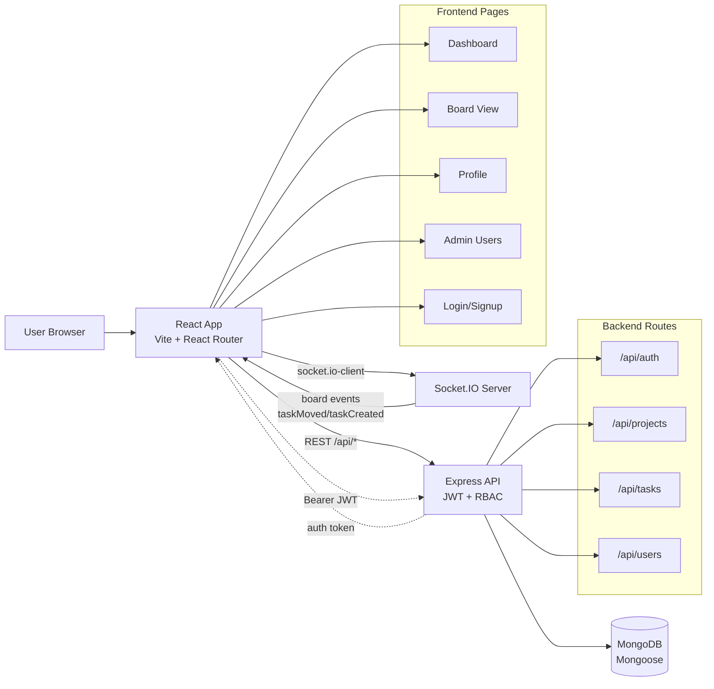
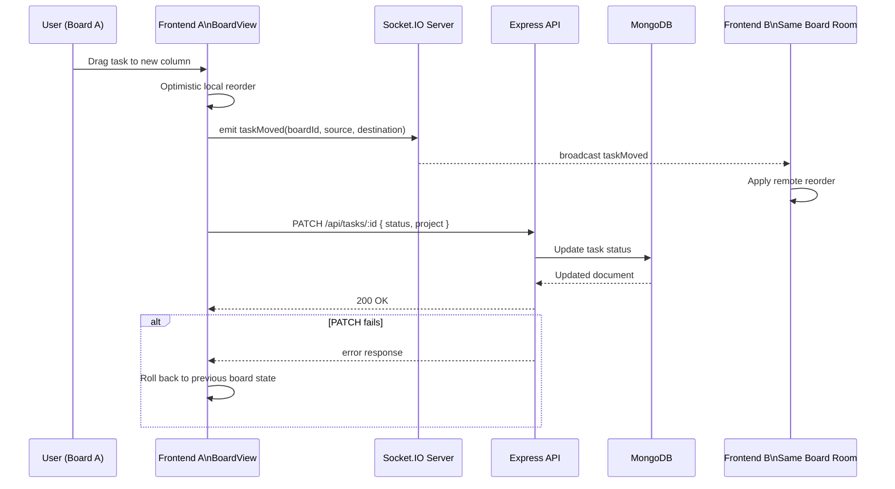
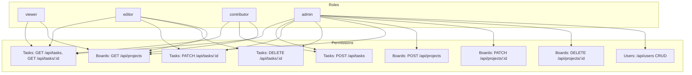

# Task Flow

Task Flow is a full-stack board and task management app built with React + Vite on the frontend and Express + MongoDB on the backend.

It includes:
- JWT authentication and route guards
- Multi-board project management
- Role-based access control (viewer/editor/contributor/admin)
- Real-time board updates with Socket.IO
- Admin-only user management
- Tailwind + SCSS styling and Font Awesome icons
- Unified loading spinners for page loads and action states

## Stack

- Frontend: React 18, React Router, Vite
- Backend: Express, Mongoose, JWT, bcryptjs
- Realtime: socket.io + socket.io-client
- Styling: Tailwind CSS, SCSS, Font Awesome

## Quick Start

1. Install dependencies:

```bash
npm install --legacy-peer-deps
```

2. Set environment values in `.env.local` (or `.env`):
- `MONGODB_URI`
- `JWT_SECRET`
- Optional: `PORT` (defaults to `3000`)

3. Seed demo data:

```bash
npm run seed
```

4. Start backend:

```bash
npm run server
```

5. Start frontend:

```bash
npm run dev
```

Node requirement: `>=20 <21 || >=22 <23 || >=24 <25`.

Recommended for local development: use Node 24 LTS.

If you use nvm:

```bash
nvm install 24
nvm use 24
```

## Demo Users

After running `npm run seed`, all demo users share this password:
- `Passw0rd!`

Available accounts:
- `demo@example.com` (admin)
- `viewer.employee@example.com` (viewer)
- `editor.employee@example.com` (editor)
- `contributor.employee@example.com` (contributor)
- `admin.employee@example.com` (admin)

## Frontend Routes

Defined in `src/App.jsx`:
- `/login` (guest only)
- `/signup` (guest only)
- `/dashboard` (authenticated)
- `/boards/:boardId` (authenticated)
- `/profile` (authenticated)
- `/users` (admin only)

## Theme and Profile

- Theme mode is controlled from `/profile` only.
- Modes: `auto`, `light`, `dark`.
- Mode is persisted in localStorage (`theme_mode`) and stays across reloads.
- Header shows read-only current theme mode indicator.

## Realtime Boards (Socket.IO)

Socket server is initialized in `server/index.js`.

Supported socket events:
- `joinBoard` (room join)
- `leaveBoard` (room leave)
- `taskMoved` (broadcast to other users in the board room)
- `taskCreated` (broadcast to other users in the board room)

Frontend socket client lives in `src/lib/socket.js` and board sync is handled in `src/pages/BoardView.jsx`.

## API Overview

### Health
- `GET /health`

### Auth (`/api/auth`)
- `POST /register`
- `POST /login`

### Projects / Boards (`/api/projects`)
- `GET /` (authenticated)
- `POST /` (admin)
- `PATCH /:id` (admin)
- `DELETE /:id` (admin, cascades board tasks)

### Tasks (`/api/tasks`)
- `GET /` (authenticated)
- `GET /:id` (authenticated)
- `POST /` (admin, contributor)
- `PATCH /:id` (admin, editor)
- `DELETE /:id` (admin, editor)

Filters supported for `GET /api/tasks`:
- `project,status,assignee,search,tags,sort,page,limit`

### Users (`/api/users`) - Admin Only
- `GET /`
- `POST /`
- `PATCH /:id`
- `DELETE /:id` (self-delete blocked)

### Custom Compatibility Endpoints (root)
- `GET /boards?project=<id>`
- `POST /create-task`
- `PUT /update-task-status`

## RBAC Summary

Roles:
- `viewer`: read-only access
- `editor`: can update/delete tasks
- `contributor`: can create tasks
- `admin`: full access, board and user management

Legacy role `user` is normalized to `viewer` by auth middleware.

## Styling Notes

- Source styles are now SCSS:
	- `src/index.scss`
	- `src/App.scss`
	- `src/pages/Dashboard.scss`
	- `src/pages/Profile.scss`
	- `src/pages/auth.scss`
- Tailwind utilities and `@apply` are used throughout.
- `sass` is installed as a dev dependency for SCSS compilation.

## Scripts

- `npm run dev` - start frontend dev server
- `npm run build` - production build
- `npm run preview` - preview production build
- `npm run server` - start backend API server
- `npm run seed` - seed demo users, boards, and tasks
- `npm run test:db` - test Mongo connection script
- `npm run lint` - run ESLint

## DB Models

Models in `server/models`:
- `user.js`
- `project.js`
- `task.js`

DB connection helper: `server/db.js`.

## Useful File Map

- Frontend app shell and guards: `src/App.jsx`
- Dashboard boards page: `src/pages/Dashboard.jsx`
- Board detail + drag/drop + realtime: `src/pages/BoardView.jsx`
- Admin users CRUD: `src/pages/Users.jsx`
- Profile/theme settings: `src/pages/Profile.jsx`
- API helper: `src/lib/api.js`
- Socket client: `src/lib/socket.js`
- API server bootstrap + sockets: `server/index.js`

## Architecture Diagram



## Task Move Lifecycle



## RBAC Permission Map



## Troubleshooting

- If install has peer resolution issues in this environment, use:

```bash
npm install --legacy-peer-deps
```

- If DB auth fails, verify URL-encoding in `MONGODB_URI`.
- If auth requests fail, verify `JWT_SECRET` is set and backend is running.
